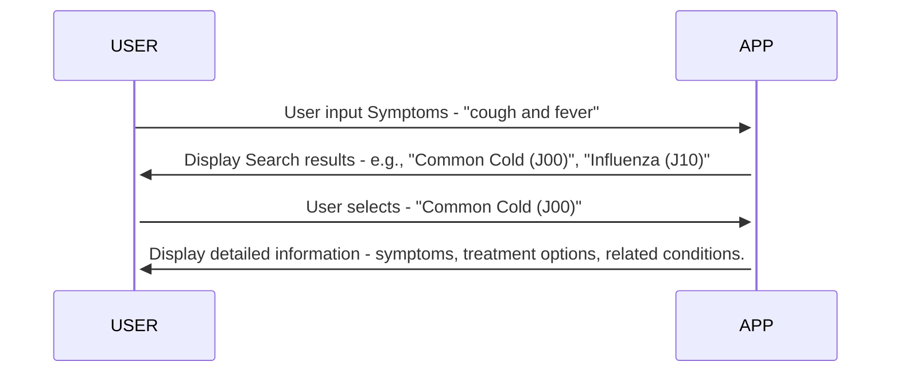
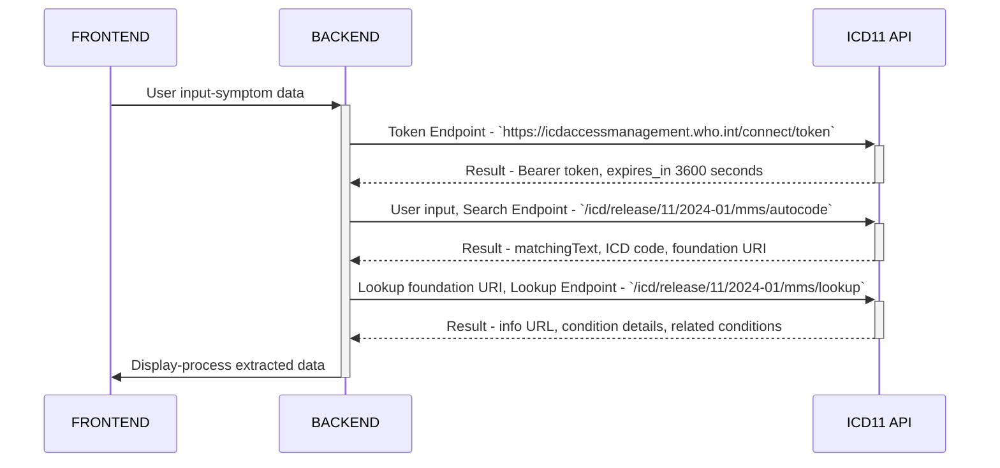

# Symptom Analysis Logic

## Data Processing Steps
1. Symptom Input Processing
    - Normalize and sanitize user input to ensure it is suitable for querying the API.

2. Search Result Processing
    - Parse the JSON response from the ICD API to extract relevant fields like code and term.
    - Rank or filter results based on relevance to the input symptoms.

3. Detailed Information Processing
    - Parse the detailed response JSON to extract comprehensive information about the condition.
    - Format the information for clear presentation to the user.

 

## User-Application Interaction

 

# Frontend-Backend Interaction

 

# ICD API Requests Flow

 
